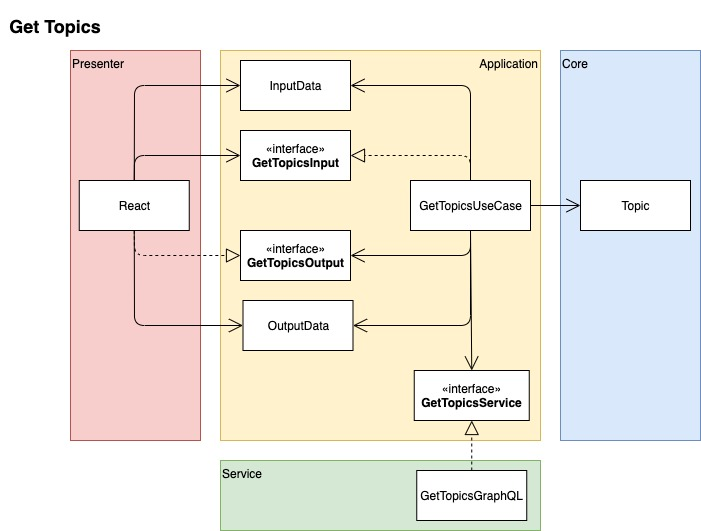

# flashcards

Flashcards app using clean architecture.

This is composed by server side which creates a graphql server and client side.

## Preparing to run

### Firebase

Create a firebase app and fill a .env.local file with these values inside `packages/presentation` with this format.

```ini
NEXT_PUBLIC_FIREBASE_API_KEY=################
NEXT_PUBLIC_FIREBASE_AUTH_DOMAIN=################
NEXT_PUBLIC_FIREBASE_PROJECT_ID=################
NEXT_PUBLIC_FIREBASE_SENDER_ID=################
NEXT_PUBLIC_FIREBASE_APP_ID=################
NEXT_PUBLIC_FIREBASE_MEASUREMENT_ID=################
```

Create a Firebase's service account going to your Firebase project settings / service accounts / generate new private key. Put the file inside `packages/server/src/main` named as `service-account.json`.

Create a new firestore database.

### Docker

Install docker

## Start web project

So far we just have a web project.

run `yarn dev`

## Architecture

I'm trying to follow Bob Martin's Clean Architecture but adapted to a frontend project.


